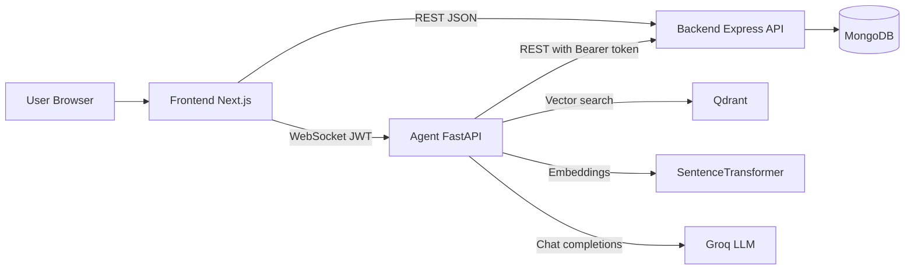

# Blue Island Beach Hotel Platform Deep Dive

## 1) Executive Summary
This platform is a 3-service system:
- Frontend: Next.js web app for customer and admin interactions.
- Backend: Node.js + Express API for users, rooms, bookings, admin stats, and conversation storage.
- Agent Service: FastAPI + Groq + Qdrant + embeddings for conversational booking and RAG answers.

The architecture is hybrid deterministic + LLM:
- Deterministic workflows are used for critical booking actions (book/cancel/reschedule) to reduce hallucinations.
- LLM tool-calling is used for flexible dialogue and fallback logic.
- RAG retrieval is used for hotel knowledge questions.

## 2) System Architecture

### 2.1 Frontend Responsibilities
- Authentication UX and token storage.
- Booking and admin pages.
- Real-time chat UI via WebSocket.
- Document upload/list/delete calls to the agent admin endpoints.

### 2.2 Backend Responsibilities
- Identity: register/login/JWT issue and JWT verification.
- Core business logic: rooms, bookings, admin dashboard.
- Persistent conversation collection in MongoDB.

### 2.3 Agent Responsibilities
- Maintains per-user agent session cache during WebSocket connection.
- Executes deterministic booking workflows.
- Uses Groq tool-calling when needed.
- Queries vector knowledge base for FAQ/hotel information.
- Persists conversation history into backend conversation endpoints.

## 3) End-to-End Chat Flow

## 3.1 Session Startup
1. User logs in on frontend and receives JWT from backend.
2. Frontend opens WebSocket to agent: /api/chat/ws/{userId}?token={jwt}.
3. Agent verifies JWT and ensures token userId equals path userId.
4. Agent creates/loads per-user BookingAgent instance and sends welcome message.

## 3.2 Message Processing
1. Frontend sends { "message": "..." } through WebSocket.
2. Agent stores user message in memory and persists it via backend conversation save endpoint.
3. Agent tries deterministic structured flow first.
4. If not matched, agent asks Groq with tool definitions.
5. If Groq emits tool calls, agent executes tools and returns deterministic post-tool response when configured.
6. Agent persists assistant response via conversation save endpoint.
7. Frontend renders response and clears typing state.

## 3.3 Error Handling
- Agent WebSocket route catches processing exceptions and sends type=error payload.
- Frontend chat component handles onerror/onclose and resets typing indicator to avoid infinite spinner.

## 4) Authentication and Authorization

## 4.1 User Authentication in Backend
- Backend issues JWT at login/register with claims userId and role.
- Protected routes use Bearer token middleware to verify JWT and load user.
- Role checks are applied via requireRole for admin/user boundaries.

## 4.2 Frontend Auth Handling
- Token + user payload stored in localStorage key hotel_booking_auth.
- Frontend decodes token exp and clears expired/invalid tokens.
- 401 responses trigger auth clear and redirect from protected pages.

## 4.3 Agent Authentication
- Chat WebSocket validates JWT directly using same secret and algorithm.
- Agent also validates token userId matches requested path userId.
- For booking operations against backend API, agent forwards user Bearer token.

## 4.4 Agent to Backend API Authentication
- For protected booking endpoints, ExpressAPIClient sets Authorization: Bearer {token}.
- This enforces same backend access control as normal frontend REST calls.

## 4.5 Can Agent Call Every Backend API Without Authentication?
Short answer: no for protected endpoints, yes for public endpoints.

Details:
- Protected by JWT: bookings create/list/get/update/delete, admin dashboard.
- Public in current backend: room listing/search/get by id.
- Conversation endpoints are currently implemented without auth for save/history/delete (internal-trust assumption). This is a real security gap and should be hardened.

## 5) How Agent Understands User Requirements
The agent uses layered understanding:
- Text normalization for ambiguous patterns.
- Regex/entity extraction for dates, guest count, booking id, email, phone, name.
- Intent detection heuristics for book/cancel/reschedule/knowledge queries.
- Stateful slot filling in flow_state across turns.
- Explicit confirmation gating before destructive actions.

This design improves reliability versus pure free-form LLM behavior.

## 6) Tool Calling Design

## 6.1 Tool Definitions
Agent exposes tools such as:
- search_rooms
- create_booking
- get_user_bookings
- cancel_booking
- reschedule_booking
- get_booking_status
- search_knowledge_base
- get_available_dates

## 6.2 Execution Safety Controls
- Parameter coercion for string-to-number issues.
- Required-parameter validation.
- Booking-id format validation.
- Intent mismatch block (for example blocking cancellation during reschedule context).
- Deterministic response templates for key operations to reduce hallucination.

## 6.3 Pseudo Tool-Call Recovery
If model text contains pseudo syntax instead of real tool_calls for KB search, agent parses and executes deterministic vector search fallback.

## 7) Memory Management
Memory has multiple layers:
- In-process session cache: global _agents dictionary keyed by userId.
- Per-agent conversation list: conversation_history.
- Deterministic workflow state: flow_state with intent/stage/slots.
- Persistence layer: backend conversation collection in MongoDB.
- LangGraph MemorySaver object exists but current core flow primarily uses conversation_history + Mongo persistence.

Implication:
- Session continuity is good while service is running.
- Horizontal scaling and restart continuity depend on Mongo-backed history rehydrate.
- _agents is single-process memory; multi-instance routing needs sticky sessions or external session state.

## 8) Vector Search and RAG Understanding

## 8.1 Ingestion
- Admin uploads PDF to agent admin endpoint.
- Text extracted with PyPDF2.
- Chunking by RecursiveCharacterTextSplitter.
- Embeddings generated by sentence-transformers/all-MiniLM-L6-v2.
- Chunks stored in Qdrant with metadata (source, chunk index, uploader, etc.).

## 8.2 Retrieval
- Query embedding generated from user question.
- Qdrant search compatibility supports both search and query_points API variants.
- Top-k chunks returned with score and metadata.

## 8.3 Answer Formation
- Knowledge queries are detected and routed deterministically.
- Formatter cleans PDF artifacts and applies intent-aware extraction (room categories/contact details).
- If formatter cannot synthesize cleanly, user gets a constrained fallback prompt for specificity.

## 9) Technology Stack

Frontend:
- Next.js App Router
- React + TypeScript
- Browser WebSocket

Backend:
- Node.js + Express
- Mongoose + MongoDB
- JWT auth
- Helmet + CORS + rate-limit

Agent:
- FastAPI
- Groq chat completions
- Qdrant vector DB
- sentence-transformers embeddings
- httpx for backend calls

## 10) Current Strengths
- Clear split of concerns across frontend/backend/agent.
- Deterministic control for critical transactional flows.
- Shared JWT identity model between frontend and agent.
- Practical RAG integration with admin document management.
- User-facing chat resiliency improved for disconnect/error states.

## 11) Known Constraints and Risks
- Conversation endpoints in backend are unauthenticated by design (internal-call assumption).
- WebSocket token passed via query string (common, but has logging/exposure risk).
- Agent service currently trusts direct backend conversation API access without service-level auth.
- In-memory _agents cache does not natively support multi-instance scale.
- RAG answer quality still depends on document chunk quality and retrieval relevance tuning.

## 12) Recommended Immediate Hardening
1. Protect conversation endpoints with either:
- service-to-service token from agent, or
- regular JWT user auth with userId enforcement.
2. Reduce token-in-query exposure (short-lived WS token or secure upgrade flow).
3. Add structured observability for tool latency, retrieval hit quality, and fallback rates.
4. Add automated evaluation set for RAG accuracy on hotel KB FAQs.

## 13) Practical Mental Model for Learning
Think of this platform as:
- Frontend is channel and UX.
- Backend is system of record and policy gate.
- Agent is orchestration and reasoning layer.
- Qdrant is semantic memory for knowledge, not transactional truth.

For booking truth:
- Always trust backend DB responses.

For informational answers:
- Trust retrieved chunks + deterministic formatter, then LLM only for language quality where safe.
